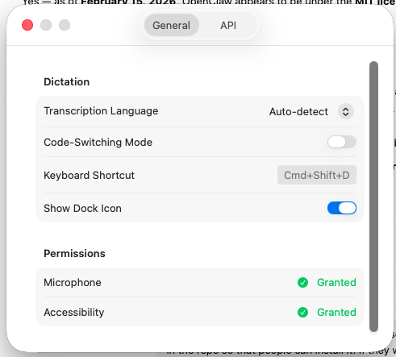
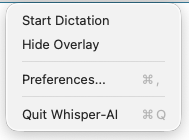
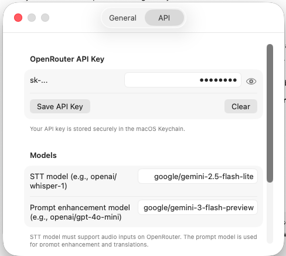

# Hola-AI

## Screenshots

<table>
  <tr>
    <td colspan="2" align="center"></td>
  </tr>
  <tr>
    <td></td>
    <td></td>
  </tr>
  <tr>
    <td colspan="2" align="center"></td>
  </tr>
</table>

Hola-AI is a macOS dictation app that records your voice, transcribes it with OpenRouter models, cleans the output, and pastes text into the active app.

## Features

- Floating overlay with one-click microphone control
- Two model settings in Preferences: STT model (speech-to-text) and prompt model (enhancement/translation)
- Prompt enhancement mode (rewrites and improves prompts in English)
- Dictation mode with cleanup (fills, repetitions, coherence fixes)
- Optional translation-to-English in dictation mode
- Paste-where-cursor-is behavior (Whisper Flow style)
- Copy last spoken text button
- Global shortcuts: `Cmd+Shift+D` start/stop dictation, `Cmd+Shift+C` command mode toggle

## Install (Prebuilt App in This Repo)

1. Download the latest DMG from [GitHub Releases](https://github.com/jbeltran73-2/hola-ai/releases/latest).
2. Open it and drag `Hola-AI.app` to `Applications`.
3. Open `Hola-AI` (first launch may require right-click -> Open).
4. Grant permissions: Microphone and Accessibility.
5. Open Preferences and set your OpenRouter API key, STT model, and prompt enhancement model.

## First-Time Setup

In Preferences:

- `OpenRouter API Key`: stored in macOS Keychain
- `STT model`: model that accepts audio input
- `Prompt enhancement model`: model used for enhanced prompts and text transforms
- `Show Dock Icon`: show/hide app in Dock while running

## Build from Source

Requirements:

- macOS 13+
- Xcode 15+ (or compatible Swift toolchain with macOS SDK)

Build:

```bash
swift build
```

Run:

```bash
swift run HolaAI
```

Package app + DMG:

```bash
bash scripts/build-dmg.sh
```

Output:

- `dist/Hola-AI.app`
- `dist/Hola-AI-1.0.1.dmg`

## Privacy

- Your API key is stored locally in your Keychain.
- This repository does not include your API key.
- Audio/text are processed via your configured OpenRouter models.
- Prebuilt binaries in this repo do not embed your personal API key.

## License

This project is licensed under the MIT License. See `LICENSE`.
